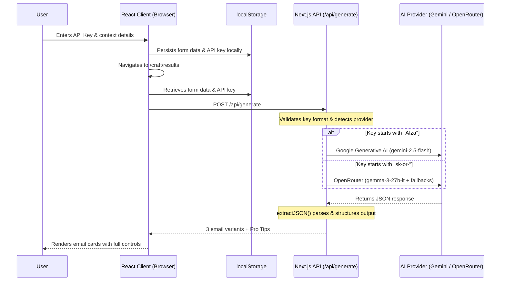

# Outreach

> 3 inputs. 3 styles. 12 seconds. One unfair advantage in every inbox.

[](https://nextjs.org/)
[](https://www.typescriptlang.org/)
[](https://tailwindcss.com/)
[](https://vercel.com/)
[](LICENSE)

**Live Demo:** [outreach-copilot.vercel.app](https://outreach-copilot.vercel.app)
**GitHub:** [github.com/Shriraj888/v0-outreach-app](https://github.com/Shriraj888/v0-outreach-app)

---

## What is Outreach?

Cold outreach is broken. Writing one cold email takes 30–60 minutes and it still sounds generic. Most people don't even send it. **Blank page paralysis is real.**

**Outreach** fixes that. Tell it who you're emailing, what you want, and why they should care — and it generates three ready-to-send cold emails in 12 seconds.

| Style | Tone |
|---|---|
| **Formal** | Professional, structured, recruiter-ready |
| **Casual** | Warm, friendly, easy to respond to |
| **Bold** | Direct, confident, attention-grabbing |

No account. No subscription. No setup. Just results.

---

## Features

- **Dual AI Provider Support** — Gemini (`gemini-2.5-flash`) and OpenRouter (`gemma-3-27b-it`), auto-detected by key prefix
- **Live API Key Verification** — key is validated before form submission, never stored on any server
- **Partial Generation** — Casual and Bold render while Formal is still streaming
- **Stop Generation** — cancels the active API call instantly via `AbortController`
- **Per-Style Regeneration** — regenerate one email card without restarting all three
- **Suggest Edits** — refine a single card with natural language; other variants are untouched
- **One-Click Export** — pre-populates Gmail, Outlook, Yahoo, or your default mail client
- **Email Branding** — upload a custom header/footer banner for branded outreach
- **Pro Tips** — context-aware outreach insights generated from your exact inputs
- **Smooth Scroll** — Lenis-powered buttery scroll experience throughout the app
- **Fully Serverless** — no database, no backend infra, zero operational cost

---

## Data Flow



---

## Tech Stack

| Layer | Technology |
|---|---|
| Framework | Next.js 16 (App Router) |
| Runtime | React 19 |
| Language | TypeScript 5.7 |
| Styling | Tailwind CSS v4 |
| Components | shadcn/ui + Radix UI |
| Animation | Framer Motion + GSAP |
| Scroll | Lenis |
| Forms | React Hook Form + Zod |
| AI — Gemini | `@ai-sdk/google` → `gemini-2.5-flash` |
| AI — OpenRouter | `@openrouter/ai-sdk-provider` → `gemma-3-27b-it` |
| AI SDK | Vercel AI SDK (`ai`) |
| Analytics | `@vercel/analytics` |
| Deployment | Vercel |

---

## How It Works

```
1. User fills out the form (recipient, goal, value prop) and enters an API key
        ↓
2. Key prefix detected: AIza* → Gemini  |  sk-or-* → OpenRouter
        ↓
3. POST /api/generate — Vercel AI SDK calls generateText()
        ↓
4. extractJSON() strips markdown fences, finds JSON anywhere in the response
        ↓
5. Gemini:      2 retry attempts with 1s / 2s backoff on rate-limit
   OpenRouter:  sequential fallback across 4 models (paid → free)
        ↓
6. 3 email variants + contextual Pro Tips returned to the client
```

---

## Getting Started

### Prerequisites

- **Node.js** >= 20
- A free API key from [Google AI Studio](https://aistudio.google.com/apikey) *(starts with `AIza`)* **or** [OpenRouter](https://openrouter.ai/keys) *(starts with `sk-or-`)*

### Installation

```bash
git clone https://github.com/Shriraj888/v0-outreach-app.git
cd v0-outreach-app
npm install
npm run dev
```

Open [http://localhost:3000](http://localhost:3000) in your browser.

### No `.env` File Required

API keys are entered in the UI and stored in `localStorage`. Nothing is sent to any external database — your key never leaves your device.

---

## Project Structure

```
v0-outreach-app/
├── app/
│   ├── api/
│   │   └── generate/route.ts       # AI pipeline: provider routing, retry, JSON parsing
│   ├── craft/
│   │   ├── page.tsx                # Email form page (/craft)
│   │   └── results/page.tsx        # Results page (/craft/results)
│   ├── globals.css                 # Global styles
│   ├── layout.tsx                  # Root layout with Lenis & analytics
│   └── page.tsx                    # Landing page
├── components/
│   ├── api-key-input.tsx           # Key input with auto-detect & live verification
│   ├── craft-form.tsx              # Multi-step email form
│   ├── email-banner-settings.tsx   # Custom header/footer banner uploader
│   ├── email-card.tsx              # Email variant card with all controls
│   ├── features-section.tsx        # Bento grid features section
│   ├── footer.tsx                  # Site footer
│   ├── generating-loader.tsx       # Animated loader during generation
│   ├── hero-section.tsx            # Landing page hero
│   ├── how-it-works-section.tsx    # Step-by-step walkthrough
│   ├── lenis-provider.tsx          # Lenis smooth scroll provider
│   ├── navbar.tsx                  # Navigation bar
│   ├── pro-tips.tsx                # AI-generated outreach tips card
│   ├── shimmer-cards.tsx           # Skeleton loader cards
│   └── ui/                         # shadcn/ui primitives
├── hooks/                          # Custom React hooks
├── lib/
│   └── utils.ts                    # Shared utilities (cn helper, etc.)
├── styles/                         # Additional style modules
├── next.config.mjs
├── tailwind.config (via postcss)
└── tsconfig.json
```

---

## AI Pipeline Details

### Provider Auto-Detection

```typescript
const isGemini    = apiKey.startsWith("AIza")   // → gemini-2.5-flash
const isOpenRouter = apiKey.startsWith("sk-or-") // → gemma-3-27b-it
```

### Resilient JSON Parsing

```typescript
function extractJSON(text: string) {
  // 1. Attempt direct JSON.parse
  // 2. Strip ```json ... ``` markdown fences
  // 3. Regex scan to find first { ... } block anywhere in the response
}
```

### Retry & Fallback Strategy

```typescript
// Gemini:     up to 2 retries → 1s delay → 2s delay
// OpenRouter: sequential fallback across 4 models (paid → free tier)
// Both:       AbortController support for mid-generation cancellation
```

---

## Target Audience

- 🎓 **Students** — hunting internships and entry-level jobs
- 💼 **Freelancers** — pitching clients and new projects
- 🚀 **Founders** — doing early-stage sales and partnership outreach
- 👔 **Professionals** — at any career stage needing fast, high-quality outreach

---

## Roadmap

- [ ] Chrome Extension — generate cold emails from any LinkedIn profile
- [ ] CRM Integration — HubSpot, Notion, Airtable sync
- [ ] Multi-language Support
- [ ] Analytics Dashboard — open rates, reply rates, best-performing tone
- [ ] Email Sequences — auto-generate follow-up threads
- [ ] Fine-tuned models trained on high-reply-rate datasets

---

## Author

**Shriraj Patil**  
[LinkedIn](https://www.linkedin.com/in/shriraj-patil888/) · [GitHub](https://github.com/Shriraj888) · [Twitter/X](https://x.com/shriraj399)

---

*Scaffolded with [v0.dev](https://v0.dev) · Deployed on [Vercel](https://vercel.com)*
